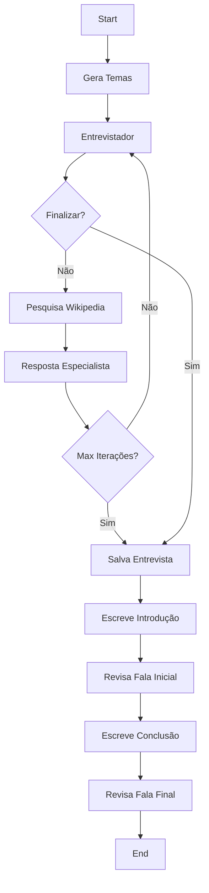

# 🎙️ Gerador de Podcasts com IA - LangGraph

Um sistema automatizado que cria podcasts completos em apenas 2 minutos usando LangGraph, GPT-4 e Text-to-Speech da OpenAI.

## 🎬 Tutorial Youtube

Você pode encontrar o video explicativo no youtube: https://www.youtube.com/watch?v=rkfRmMVxqw0

## 🚀 Demonstração

Este projeto gera automaticamente:
- ✅ Roteiro completo de entrevista entre apresentador e especialista
- ✅ Pesquisa automática de informações na Wikipedia
- ✅ Conversão de texto em áudio com vozes naturais
- ✅ Podcast finalizado e pronto para publicação

## 📋 Índice

- [Características](#-características)
- [Pré-requisitos](#-pré-requisitos)
- [Instalação](#-instalação)
- [Configuração](#-configuração)
- [Como Usar](#-como-usar)
- [Arquitetura](#-arquitetura)
- [Estrutura do Projeto](#-estrutura-do-projeto)
- [Personalização](#-personalização)
- [Exemplos](#-exemplos)
- [Troubleshooting](#-troubleshooting)

## ✨ Características

- **Geração Inteligente de Conteúdo**: Utiliza GPT-4o mini para criar diálogos naturais
- **Pesquisa Automática**: Integração com Wikipedia para enriquecer o conteúdo
- **Múltiplas Vozes**: Suporte para diferentes vozes (apresentador e entrevistado)
- **Fluxo Orquestrado**: LangGraph gerencia todo o processo de criação
- **Áudio de Alta Qualidade**: Conversão TTS com as melhores vozes da OpenAI
- **Personalização Total**: Ajuste temas, vozes e estilos de apresentação

## 📦 Pré-requisitos

- Python 3.11 ou superior
- Conta na OpenAI com créditos (**Mas você pode escolher qualquer outro modelo**)
- ffmpeg instalado no sistema (para processamento de áudio)

## 🔧 Instalação

### Usando PIP

1. **Clone o repositório**
```bash
git clone https://github.com/gustavo-sacchi/minipodcast_com_ia.git
cd minipodcast_com_ia
```

2. **Crie um ambiente virtual**
```bash
python -m venv venv
source venv/bin/activate  # No Windows: venv\Scripts\activate
```

3. **Instale as dependências**
```bash
pip install -r requirements.txt
```

4. **Instale o ffmpeg**
- **Windows**: Baixe de [ffmpeg.org](https://ffmpeg.org/download.html)
- **Mac**: `brew install ffmpeg`
- **Linux**: `sudo apt-get install ffmpeg`

### Usando UV

- Pré-requisitos [uv](https://docs.astral.sh/uv/getting-started/installation/) instalado

1. Clonar repositório:

```bash
# Clone o repositório
git clone clone https://github.com/gustavo-sacchi/minipodcast_com_ia.git
cd minipodcast_com_ia
```
2. Instale as dependências

```bash
uv sync
```

3. Ative o ambiente virtual

```bash
source .venv/bin/activate  # Linux/Mac
# ou
.venv\Scripts\activate     # Windows
```

**Alternativa rápida**

```bash
# Instala e executa em um comando
uv run python podcast.py
```

## ⚙️ Configuração

1. **Troque o nome do arquivo `.env.exemplo` para `.env` na raiz do projeto e preencha**
```env
OPENAI_API_KEY=API_KEY
```

2. **Obtenha sua API Key** da Open IA ou utilize qualquer outra API de sua preferência.

OBS: Para audio utilizamos o `GPT-4o mini TTS` mas você pode usar o ElevenLabs ou `kokoro TTS`

## 🎯 Como Usar

### Uso Básico
```python
from main import main

# Gerar um podcast sobre viagens
main(
    topico="Viagens pelo mundo. Conhecendo lugares inimagináveis.",
    entrevistado="Influencer: Sara, do canal Viagens da Sara.",
    podcast_file="viagem.wav"
)
```
## 🏗️ Arquitetura

### Fluxo do LangGraph



### Componentes Principais

1. **StateGraph (LangGraph)**
   - Gerencia o fluxo de criação do podcast
   - Mantém o estado da conversa
   - Coordena as transições entre etapas

2. **Agentes de IA**
   - Entrevistador: Gera perguntas relevantes
   - Especialista: Responde com base em pesquisas
   - Roteirista: Cria introdução e conclusão

3. **Sistema de Áudio**
   - Text-to-Speech com OpenAI
   - Processamento com Pydub
   - Concatenação automática de falas

## 📁 Estrutura do Projeto

```
podcast-generator-langgraph/
│
├── src/
│   ├── __init__.py
│   ├── graph.py           # Definição do LangGraph
│   ├── state_app.py       # Estados e tipos
│   └── create_audio.py    # Geração de áudio
│
├── pyproject.toml         # Script de configuração do ambiente
├── podcast.py             # Script principal
├── .env                  # Variáveis de ambiente
├── requirements.txt      # Dependências
└── README.md            # Este arquivo
└── Viagem.wav            # Audio resultado do nosso teste
```

## 🎨 Personalização

### Alterar Vozes
```python
# Em main.py
self.apresentador = SpeechGenerator(
    api_key,
    voice="nova",  # Opções: alloy, echo, fable, onyx, nova, shimmer
    instructions="Seja energético e entusiasmado!"
)
```

## 📚 Exemplos

### Exemplo 1: Podcast sobre Tecnologia
```python
main(
    topico="O futuro da Inteligência Artificial Generativa",
    entrevistado="Dra. Ana Costa, pesquisadora em IA do MIT",
    podcast_file="ia_futuro.wav"
)
```

### Exemplo 2: Podcast Educacional
```python
main(
    topico="Como aprender programação do zero em 2025",
    entrevistado="Carlos Dev, criador do canal Código Limpo",
    podcast_file="aprender_programacao.wav"
)
```

## 🐛 Troubleshooting

### Erro: "No module named 'dotenv'"
```bash
pip install python-dotenv
```

### Erro: "ffmpeg not found"
Certifique-se de que o ffmpeg está instalado e no PATH do sistema.

### Áudio não está sendo gerado
- Verifique se sua API key está correta
- Confirme se você tem créditos na OpenAI
- Teste com um texto menor primeiro

